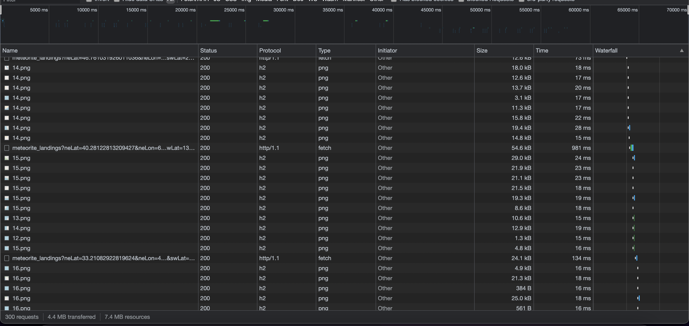
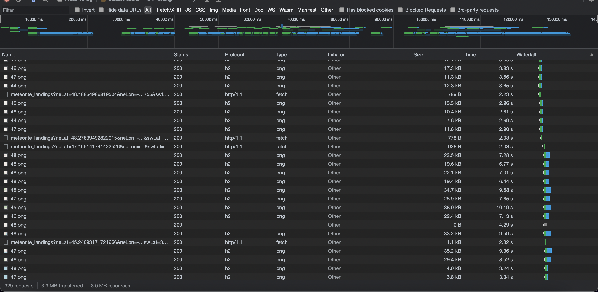
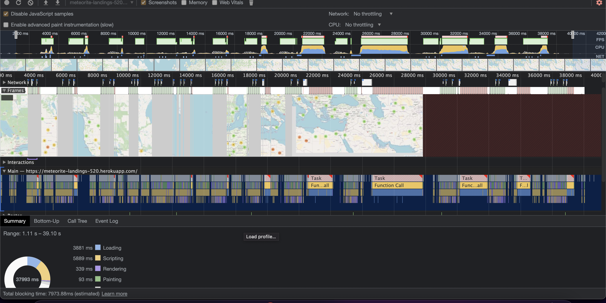
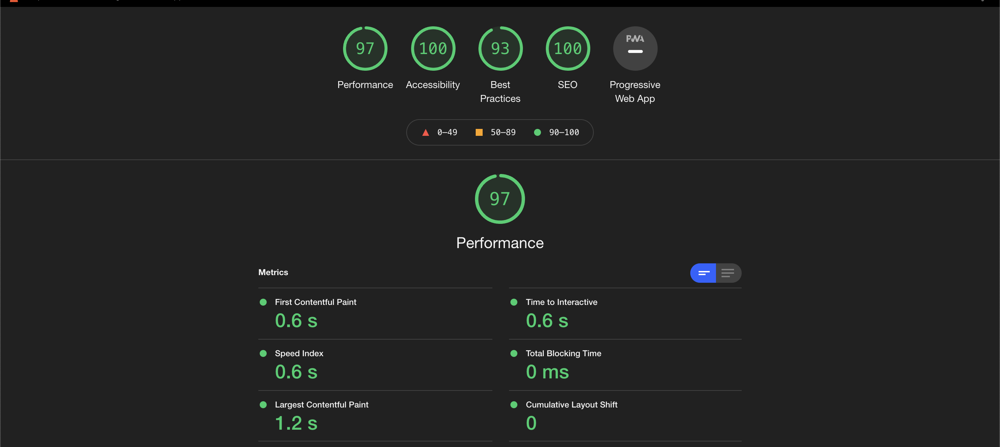

# 520-Project-Makeen-Sreng_Flores
Name: Zacharie Makeen

Id: 1938801

Name: Juan-Carlos Sreng-Flores

Id: 1533920


Resource data set: 

https://www.kaggle.com/nasa/meteorite-landings

## Attributions

### Source data set

The dataset was taken from the nasa within the `Kaggle` website. The reference can be found under this paragraph:

https://www.kaggle.com/nasa/meteorite-landings

### Leafletm Map

The application runs with `React` leaflet api program with tons of usable componetns and functions. The reference to the 
leaflet can be found under this paragraph:

https://react-leaflet.js.org/

### MeteoriteMapMove Component

The source code for the `<MapMoveComponent/>` has been taken from Professor Jaya Nilakantan at Dawson College. 

## Configuration 

### MinZoom value.

The configuration of the minimum zoom in the `config.js` file is at a value of `5` since for any lower zoom values the rendering would take too long to load due to the size of the data set.

If you wish to see more of the map for evaluation you may need to change the value of minZoom in the `config.js` file within the `client/src/utils/config.js` path.

<br>
<br>
<br>

# Performance of Meteorite-Landings-520

## Introduction and Methodology

The meteorite landings application was tested with Google Chrome's developer tools. The browser version at the time of testing was Version 96.0.4664.93 (Official Build) (arm64). The tests were performed on a Macbook Pro 2021 with a viewport of 1440 by 900.

## Functionality

Solely from manual testing, it was noticed that fetching would take a cosiderable amount of time to fetch a lot of data. For example, a location near Africa contains 6000+ objects, which makes the website inoperative for a few seconds. On the bright side, other regions with less data would perform a lot better.

The use of setting the minimum zoom to a higher value did help improve the overall performance since less data is fetched from the server. 

## Network Test

### No Throttling

The network activity without throttling showed that rendering each chunk of land generally took around 50 ms on average with very little variance. In addition, the fetch requests vary in time depending on the size of the json that is returned. For example, a 54.6 kB package will take 981 ms whereas a 24.1 kB package will take 134 ms.



### Slow 3G

The network activity with slow 3g as throttling **drastically** changed the results. Chunks of land could take up to 10 seconds to download. In fact, some of the fetch requests would download before the pngs were downloaded.



### Performance Test

The recording taken from the performance tab, simulated a user moving around to different areas of the map. Obviously, the parts of the map that contained more data took much longer to render than those with less data. This caused a clear visual drop in frames. The performance profile showed that the frames would stay around 60 fps until the user stops moving the map in which case the application would need to perform a fetch and redner the points. During that time the user is unable to interact with the page until the tasks have completed. In addition, the profile showed that at the same time that frames were dropped, the CPU usage would be around 100%. It is caused by the fetching and rendering. On the main thread the tasks that would cause this massive drop in frames were `"Long Task"`, `"Run Microtasks"`, `"Function Call"`, and `"Parse HTML"`. The `Parse HTML` is not a single block but rather many small blocks because it needs to render each object individually.



## LightHouse Test
The overall score for performance averaged out to 97. Accessibility was met and resulted in a score of 100. Best practices gave a 93 due to low resolution images. SEO which optimizes basic search engine optimization was given a score of 100. Finally in the progressive web app section, there were a few issues. First, the web app manifest does not meet instability requirements. Second, it does not register a service worker that controls page and start_url. Finally, the app does not redirect HTTP traffic to HTTPS.


## Server Response Format 

The server response format for the rectangle/bounds query only returns the following:
```json
{
    _id: "id"
    geo:
    {
        coordinates: [long, lat]
    }
}
```
Since the data set contains information about the meteorite landings, it is not necessary to query all the information when only one of the `<Popup>` elements will be displayed at a time. For that reason, the server queries the `<Popup>` using the query by `_id` in order to improve the overall performance of the website.

From this improvement, a much better rendering of the `<Marker>` tags within the map can be concluded.

## Reverse Coordinates in the Server Side 

The coordinates format in Mongo Db is defined with the `Longitude` before the `Latitude`. However, when using Leaflet, it is necessary to have the `Latitude` before the `Longitude` when creating a point in the map. In order to improve efficiency of the application, the server side reverses the coordinates for the client side in the response of the fetch. Since it can assumed that a server will most likely have a "better" processing power than the user browsing the app, it will be able to reverse the coordinates much faster than the user. 

In addition, the server caches the responses for future queries which will definitely improve performance in cases where multiple fetches are done on the same bounds.

## Further Suggestions 

Another suggestion in order to improve the performance is to load all the data set upon loading the page. However, when doing so, it would be necessary to present a loading screen to the user so that the user can interact with the website, or to not have the user quit the website too early.

Doing so could potentially improve performance while moving around the map. The drawback on the other hand is that it would require a bit more memory for the device to load the website. 
## Summary of Changes

To improve the performance of the application, a projection was added to the mongodb query to fetch all the objects within the bounds of a polygon defined by the viewport. This projection specified to only return the coordinates inside of the `geo` object as well as the id which is returned by default. This massively reduces the amount of data we are fetching which improved fetch times significantly. Instead of retrieving information about a meteorite landing by passing the object from the `Map Component`, there's a fetch inside the ToolTip component which will fetch it by id.

Furthermore, the limit of how much a user can zoom out was capped at a certain number, in order to reduce how many objetcs were fetched at one time within the viewport.

## Results and Conclusion

As a result of the changes that were made, there was a noticeable different in the performance of the website. It is not 100% smooth when it comes to loading thousands of objects at a time. But, the areas with less data do not drop in frames.
